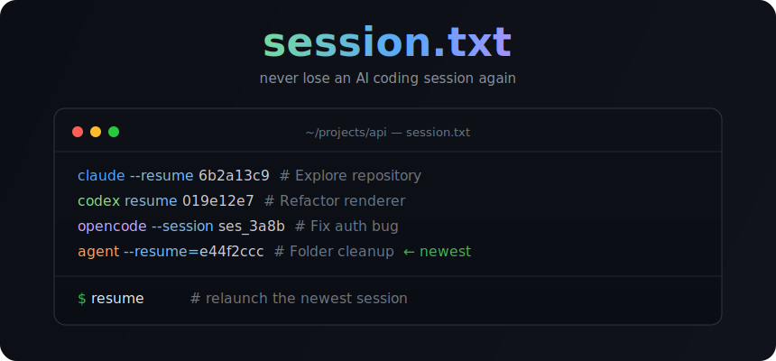

<p align="center">
  
</p>

<p align="center"><b>Never lose an AI coding session again.</b></p>

Every session you start in **Claude Code, Codex, opencode, pi, or cursor-agent** gets its **resume command** written to a `session.txt` in that folder — newest last, titled, deduplicated. Reopen the folder, glance at the file or just run `resume`, and you're right back where you left off.

```text
claude --resume 2e3204d9-fac4-4fa4-b578-09a5b1c6bfba  # Fix auth middleware
codex resume 019e12e7-6090-7372-95e0-5098aa1d98c0  # Refactor renderer
claude --resume 6b2a13c9-344c-4053-8d19-53930f371e9b  # Explore repository   ← newest
```

Each line is a runnable command; the `# title` is a shell comment (Claude's own auto-generated session title), so you can paste the whole line and it just works. No more guessing which session belonged to which folder, or hunting through `claude --resume` pickers. Just run `resume`.

## Why

`claude -c` continues the *last* session, but only if you remember which directory you were in. Codex has no session-end hook at all. This tool logs the resume command to disk **after every turn** (crash-safe) and **on exit**, and only ever records sessions that actually persisted — so the IDs in `session.txt` are always resumable.

## Install

One line — needs `jq` and `curl` (`sudo apt install jq` · `brew install jq`):

```bash
curl -fsSL https://raw.githubusercontent.com/chuk-development/session.txt/main/install.sh | bash
```

The installer:
- adds Claude Code `Stop` + `SessionEnd` hooks to `~/.claude/settings.json` (merged, existing settings untouched)
- sources a `codex` wrapper from `~/.zshrc` / `~/.bashrc`
- installs the `resume` command to `~/.local/bin`

Open a new terminal (or `source ~/.zshrc`) afterwards so the codex wrapper loads.

### Update

Re-run the same command — it is idempotent and cleans up older versions:

```bash
curl -fsSL https://raw.githubusercontent.com/chuk-development/session.txt/main/install.sh | bash
```

## Usage

It runs itself. Use Claude or Codex normally — each session appends its resume command to `session.txt` in the folder you launched from.

To jump back in:

```bash
resume          # start the newest session in ./session.txt
resume -l       # numbered list with titles (1 = oldest, at top)
resume N        # start entry N  (e.g. resume 1 = oldest)
resume N show   # just print the full command for entry N (don't run it)
```

`resume -l` prints something human-friendly instead of raw UUIDs:

```text
 1  claude  6b2a13c9  Explore repository contents
 2  codex   019e12e7  Refactor renderer
 3  claude  2e3204d9  Fix auth middleware
```

`resume` runs whatever the line says, so it resumes Claude *and* Codex sessions transparently. On every run it also **self-cleans**: any entry whose session no longer exists on disk is dropped from `session.txt`.

## Supported clients

| Client | Resume command logged | How it's captured | Title |
|--------|-----------------------|-------------------|-------|
| **Claude Code** | `claude --resume <id>` | `Stop` + `SessionEnd` hooks | ✓ (Claude's `ai-title`) |
| **Codex** | `codex resume <id>` | shell wrapper → newest `~/.codex/sessions` rollout | ✓ (first prompt) |
| **opencode** | `opencode --session <id>` | shell wrapper → newest session for this folder | ✓ |
| **pi** | `pi --session <id>` | shell wrapper → `~/.pi/agent/sessions/<folder>` | ✓ (first message) |
| **cursor-agent** / **agent** | `<cmd> --resume=<id>` | shell wrapper → `~/.cursor/chats/md5(cwd)` | ✓ (chat name) |

Cursor's CLI is wrapped under both names it ships as (`cursor-agent` and `agent`). The wrappers log on a clean exit and on **Ctrl-C** (most of these TUIs are quit with Ctrl-C), via an interrupt trap.

Other CLIs (qwen, aider) don't expose a stable per-session resume id, so they aren't logged.

## How it works

Claude Code is driven by `Stop` (after each turn) + `SessionEnd` hooks. The other clients have no session-end hook, so a shell function wraps each installed CLI and, on exit, finds the last-used session for the current folder.

Everything feeds the same writer (`session-log.sh`), which writes `<cwd>/session.txt`: it removes any existing line for that command, then appends the new one at the bottom (newest last) with a `# title` comment.

- It only logs sessions whose data actually exists on disk, so the list never fills with non-resumable entries.
- For Claude, logging after every turn means a hard crash (no clean exit) still leaves a resumable entry behind.
- `resume` self-cleans on every run: entries whose session no longer exists are dropped.

## Files

| File | Location after install |
|------|------------------------|
| `session-log.sh` | `~/.claude/hooks/session-log.sh` |
| `agent-wrappers.sh` | `~/.claude/hooks/agent-wrappers.sh` |
| `resume` | `~/.local/bin/resume` |

## Testing

```bash
bash test/test.sh   # deterministic unit/integration suite (no network)
bash test/e2e.sh    # live: runs each installed CLI headless, then checks logging
```

`test/test.sh` drives the writer and `resume` against fake session stores under a
temporary `$HOME`, covering all six tool mappings, the transcript gate, dedup,
newest-bottom ordering, self-pruning, `show`, and selection — 12 assertions, no
network. `test/e2e.sh` makes real API calls: it runs each installed agent in
headless mode and asserts a correct, resumable line is logged. Tools that aren't
installed, aren't authenticated, or whose headless mode doesn't persist a session
are reported as skipped.

## Ignore session.txt globally (optional)

To keep `session.txt` out of your git repos:

```bash
git config --global core.excludesFile ~/.config/git/ignore
echo 'session.txt' >> ~/.config/git/ignore
```

## Uninstall

```bash
curl -fsSL https://raw.githubusercontent.com/chuk-development/session.txt/main/uninstall.sh | bash
```

Removes hooks, wrapper, and the `resume` command. Existing `session.txt` files are left alone.

## License

MIT
